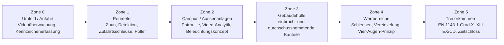

# Businessplan & Projektstudie

# «AURUM QUARTEN» — Goldraffinerie · Gold-Bunker · Security House

**Grundstück Nr. 44, Gemeinde Quarten (SG), Schweiz**

| | |
|---|---|
| **Dokumentstatus** | Projektstudie / Businessplan-Entwurf V1.0 |
| **Datum** | 20. Juli 2026 |
| **Grundlage** | ÖREB-Katasterauszug vom 20.07.2026 (Auszugsnr. 1187dc01-9d05-450e-bf90-8229a2f110db) |
| **Perimeter** | Grundstück Nr. 44, Liegenschaft, E-GRID CH218877077779, Grundbuchkreis Quarten |
| **Fläche** | 2'887'311 m² (≈ 288.7 ha) |

> **Wichtiger Hinweis:** Dieses Dokument ist eine fachliche Planungs- und Entscheidungsgrundlage. Alle Flächen-, Kosten- und Ertragsangaben sind Richtwerte (Genauigkeit ±30–40 %) und ersetzen weder eine Vorprüfung durch die Behörden (Gemeinde Quarten, AREG St. Gallen, BAZG/Zentralamt für Edelmetallkontrolle) noch eine rechtliche, steuerliche und versicherungstechnische Beratung.

---

## Inhalt

1. [Executive Summary](#1-executive-summary)
2. [Ausgangslage: Grundstücksanalyse](#2-ausgangslage-grundstücksanalyse)
3. [Projektvision & Geschäftsmodell](#3-projektvision--geschäftsmodell)
4. [Architektur- und Baukonzept](#4-architektur--und-baukonzept)
5. [Betriebskonzept Raffinerie](#5-betriebskonzept-raffinerie)
6. [Sicherheitskonzept Gold-Bunker & Security House](#6-sicherheitskonzept-gold-bunker--security-house)
7. [Recht, Zonenkonformität & Bewilligungen](#7-recht-zonenkonformität--bewilligungen)
8. [Markt & Wettbewerb](#8-markt--wettbewerb)
9. [Finanzplan (Grobschätzung)](#9-finanzplan-grobschätzung)
10. [Risikoanalyse](#10-risikoanalyse)
11. [Roadmap & Meilensteine](#11-roadmap--meilensteine)
12. [Nächste Schritte](#12-nächste-schritte)

---

## 1. Executive Summary

**Projektidee.** Auf dem Grundstück Nr. 44 in Quarten SG (Walensee-/Flumserberg-Region) soll ein integrierter Edelmetall-Campus entstehen, bestehend aus drei Bausteinen:

- **Baustein A — Goldraffinerie:** Boutique-Raffinerie für Recycling- und Minengold, Zielkapazität 30–60 t Feingold/Jahr, Ausbau auf LBMA-Good-Delivery-Standard.
- **Baustein B — Gold-Bunker:** Hochsicherheits-Wertlager (Tresoranlage nach EN 1143-1, Zielklasse Grad X–XIII mit EX/CD-Anerkennung), wahlweise als erdüberdeckter Stahlbetonbunker oder — topografisch naheliegend — als **Felskaverne im Berg**.
- **Baustein C — Security House:** 24/7 besetzte Sicherheits- und Betriebszentrale (Leitstelle, Zutrittsschleusen, Interventionsbasis).

**Kernbefund der Standortanalyse (kritisch, aber lösbar):** Der ÖREB-Auszug zeigt, dass das Grundstück heute **keine Gewerbe- oder Industriezone** enthält. Die Fläche liegt zu 68.6 % in der Landwirtschaftszone, zu 27.9 % im Skiabfahrts-/Skiübungsgelände, dazu Wald, Naturschutz-, Wildruhe- und Grundwasserschutzzonen. Eine Raffinerie ist dort **erst nach einer Zonenplanänderung / einem Sondernutzungsplan** baurechtlich möglich. Der Businessplan rechnet deshalb mit einem Planungsvorlauf von **3–5 Jahren** und definiert eine risikoärmere **Hybrid-Variante B** (Bunker auf dem Grundstück, Raffinerie in einer bestehenden Industriezone der Talregion) als Rückfallebene.

**Stärken des Standorts:** Sehr grosse, zusammenhängende Landreserve in Schweizer Rechts- und Währungsraum; Topografie ideal für eine Felskaverne (natürlicher Schutz, Diskretion, Klimastabilität); Nähe zur A3 (Achse Zürich–Chur); Lärmempfindlichkeitsstufe III auf 73.7 % der Fläche (mässig störende Betriebe zulässig); die Schweiz ist der weltweit führende Gold-Raffinerieplatz.

**Investitionsvolumen (Vollausbau, Grobschätzung):** CHF **65–105 Mio.**
**Umsatzpotenzial im Zielbetrieb (Jahr 5+):** CHF **18–35 Mio./Jahr** (Raffinagelöhne, Lagergebühren, Handelsmarge)
**Break-even:** ca. Jahr 4–6 nach Inbetriebnahme (abhängig von Auslastung und LBMA-Status).

---

## 2. Ausgangslage: Grundstücksanalyse

### 2.1 Stammdaten (gemäss ÖREB-Auszug)

| Merkmal | Wert |
|---|---|
| Grundstück-Nr. | 44 |
| Art | Liegenschaft |
| E-GRID | CH218877077779 |
| Gemeinde | Quarten (BFS-Nr. 3295), Kanton St. Gallen |
| Fläche | **2'887'311 m² (≈ 288.7 ha)** |
| Katasterstelle | Amt für Raumentwicklung und Geoinformation (AREG), St. Gallen |
| Auszugsdatum | 20.07.2026 |

Die Gemeinde Quarten umfasst die Ortsteile Murg, Quarten, Unterterzen, Oberterzen, Mols, Tannenboden und Quinten — d. h. Walensee-Südufer und Flumserberg-Nordflanke. Ein Grundstück dieser Grösse ist typischerweise eine Berg-/Alpparzelle mit grossem Höhenspektrum.

### 2.2 Zonierung (Nutzungsplanung Zonenplan, rechtskräftig)

| Zone / Hinweis | Fläche | Anteil |
|---|---:|---:|
| Landwirtschaftszone (BauG) | 1'981'705 m² | 68.6 % |
| Skiabfahrts- und Skiübungsgelände (BauG) | 806'731 m² | 27.9 % |
| Wald (Hinweis, überlagernd) | 675'628 m² | 23.3 % |
| Übriges Gemeindegebiet (BauG) | 146'714 m² | 5.1 % |
| Grünzone Naturschutz ausserhalb Baugebiet | 45'972 m² | 1.6 % |
| Intensiverholungszone Camping | 27'145 m² | 1.0 % |
| Grünzone Freihaltung innerhalb Baugebiet | 7'917 m² | 0.3 % |
| Gewässer (Hinweis) | 1'636 m² | 0.1 % |
| Grünzone Gewässerschutz ausserhalb Baugebiet | 596 m² | 0.0 % |

**Fachliche Bewertung (Architekt/Raumplanung):**

- **Keine Bauzone für Industrie/Gewerbe vorhanden.** Weder Landwirtschaftszone noch «übriges Gemeindegebiet» sind Bauzonen im Sinne von Art. 15 RPG. Eine Raffinerie, ein Wertlager und ein Sicherheitsgebäude sind dort **nicht zonenkonform** (Art. 22 Abs. 2 lit. a RPG); Ausnahmebewilligungen nach Art. 24 RPG scheiden für ein Industrieprojekt praktisch aus.
- **Konsequenz:** Es braucht eine **Teilzonenplanänderung** (Einzonung einer Spezialzone, z. B. «Zone für wertstoffverarbeitendes Gewerbe / Hochsicherheitsanlage») oder einen **Sondernutzungsplan**, beschlossen durch die Bürgerschaft der Gemeinde Quarten und genehmigt durch den Kanton (AREG). Wegen des RPG-1-Regimes (Bauzonenkompensation, Nachweis Bedarf) ist das ein anspruchsvoller, aber bei überzeugendem volkswirtschaftlichem Nutzen (Arbeitsplätze, Steuersubstrat) machbarer Weg.
- **Positiv:** 5.1 % «übriges Gemeindegebiet» (146'714 m²) ist raumplanerisch die «weichste» Kategorie und der natürliche Kandidat für die Einzonung des Raffinerie-Standorts, sofern erschliessungsnah gelegen.

### 2.3 Schutzgebiete und Restriktionen (Ausschlussflächen für die Standortwahl)

| Restriktion | Fläche/Länge | Anteil | Planerische Konsequenz |
|---|---:|---:|---|
| Grundwasserschutzzone S1 | 2'567 m² | 0.0 % | **Absolutes Bauverbot** (Fassungsbereich Quellen Chammquellen / Rinderhüttli / Molseralp) |
| Grundwasserschutzzone S2 | 108'874 m² | 3.8 % | Bauverbot für praktisch alle Anlagen; keine Chemikalien |
| Grundwasserschutzzone S3 | 303'509 m² | 10.4 % | **Kein Umgang mit wassergefährdenden Flüssigkeiten** → Raffinerie zwingend ausserhalb S1–S3 |
| Potenzieller Gewässerraum (Übergangsrecht) | 317'213 m² | 10.9 % | Freihalten von Bauten; Bestandesgarantie nur für Bestehendes |
| Lebensraum Schongebiet LR S | 220'246 m² | 7.6 % | Ausschlussfläche |
| Wildruhezone Winter (WiW) | 209'607 m² | 7.3 % | Ausschlussfläche; keine Winter-Bautätigkeit/Verkehr |
| Naturschutzgebiet feucht A (NFA) | 51'016 m² | 1.8 % | Ausschlussfläche |
| Wald | 675'628 m² | 23.3 % | Rodungsverbot; gesetzlicher Waldabstand für Bauten |
| Geschütztes Kulturobjekt (Gebäude) | 242 m² | — | **Erhaltungspflicht**; kein Abbruch; Umnutzung nur denkmalverträglich |
| Trockenmauer / Hecken | 529 m / 118 m | — | Geschützte Kleinstrukturen, erhalten/ersetzen |

### 2.4 Lärm

| Empfindlichkeitsstufe | Fläche | Anteil | Bedeutung |
|---|---:|---:|---|
| ES III | 2'128'419 m² | 73.7 % | **Mässig störende Betriebe zulässig** → passt zum Raffineriebetrieb |
| ES II | 54'485 m² | 1.9 % | Nur nicht störende Betriebe |
| ES IV | 27'145 m² | 1.0 % | Stark störende Betriebe (Campingzone) |

### 2.5 Netto-Standortpotenzial

Nach Abzug aller Ausschlussflächen (Wald, S1–S3, Gewässerraum, Naturschutz, Wildruhe, Ski-Kernflächen) verbleibt ein nutzbares Suchgebiet von grob **10–15 ha** in erschliessungsfähiger Lage — mehr als ausreichend: Der gesamte Campus benötigt netto nur **2.5–4 ha**.

**Standortstrategie innerhalb der Parzelle:**

1. **Raffinerie + Security House:** im tiefstgelegenen, strassennahen Bereich des «übrigen Gemeindegebiets», ausserhalb S1–S3 und ausserhalb des Gewässerraums, mit kurzer Anbindung an Kantonsstrasse/A3-Anschluss (Murg/Unterterzen).
2. **Gold-Bunker:** als Felskaverne in einem Felsriegel oberhalb des Raffineriestandorts — natürliche Deckung, minimale Landschaftswirkung, konstantes Klima (10–14 °C), keine Konkurrenz zu Schutzflächen an der Oberfläche.
3. Das geschützte Kulturobjekt (242 m²) wird **nicht angetastet**; Option: denkmalgerechte Umnutzung als Empfangs-/Besucherpavillon («Vertrauensarchitektur» gegenüber Kunden und Gemeinde).

---

## 3. Projektvision & Geschäftsmodell

### 3.1 Positionierung

**«Swiss Alpine Refinery & Vault» — die diskrete, vollintegrierte Wertschöpfungskette:** Annahme → Analyse → Raffination → Barrenguss → Tresorlagerung → physische Auslieferung/Werttransport. Kein Schweizer Mitbewerber bietet Raffination und Hochsicherheitslagerung **am selben Standort im Berg** an; genau diese Integration eliminiert die riskantesten und teuersten Glieder der Kette: externe Werttransporte zwischen Raffinerie und Lager.

### 3.2 Die drei Ertragssäulen

| Säule | Leistung | Ertragsmodell |
|---|---|---|
| **A — Raffination** | Recyclinggold (Altgold, Schmuck, Dental, Elektronikfraktionen), Minen-Doré, Bankengold; Feingold 999.9 | Raffinagelohn (CHF/kg bzw. % vom Feingehalt), Metallkonto-Spread |
| **B — Tresorlagerung** | Segregierte Lagerung (allocated) für HNWI, Family Offices, Händler, Fonds; Zollfreilager-Option | Lagergebühr 0.1–0.5 % p. a. des Wertes + Handling |
| **C — Services** | Analytik/Assay-Labor für Dritte, Umarbeitung, Barren-Branding (Eigenmarke), Logistik/Übergabe, Auktions-/Treuhandabwicklung | Gebühren je Leistung |

### 3.3 Zielkunden

- Schweizer und internationale **Edelmetallhändler und Banken** (Raffinage + Lagerung)
- **Minengesellschaften** mit ESG-konformer, kleiner bis mittlerer Produktion (Responsible-Sourcing-Nische)
- **Recycler/Sammler** (Schmuck, Dental, Industrie) aus CH/EU
- **Private Vermögensinhaber und Family Offices** (Bunker-Lagerung, physische Diversifikation)
- **Uhren- und Schmuckindustrie** (Halbzeuge, Legierungen — optionale Ausbaustufe)

### 3.4 Alleinstellungsmerkmale (USP)

1. **Raffinerie + Bunker + Security an einem Standort** — kein externer Werttransport zwischen Prozess und Lager.
2. **Berglage/Felskaverne** — physisch und psychologisch die stärkste Lagerbotschaft im Markt («Ihr Gold liegt im Schweizer Berg»).
3. **Lückenlose Provenienz** — Blockchain-/datenbankgestützte Chain-of-Custody vom Anlieferschein bis zur Barrennummer; Ausrichtung auf LBMA Responsible Gold Guidance und OECD Due Diligence.
4. **Grüne Raffinerie** — Wasserkraftstrom, PV-Dächer, Wärmerückgewinnung aus Schmelzöfen, geschlossene Wasser- und Chemikalienkreisläufe. Vermarktbar als «Swiss Green Gold».

---

## 4. Architektur- und Baukonzept

### 4.1 Städtebauliche / landschaftliche Haltung

Die Region lebt von Tourismus (Flumserberg, Walensee). Der Entwurf folgt deshalb dem Prinzip **«Sichtbar diskret»**:

- Flache, in den Hang geschobene Baukörper mit **begrünten Dächern**; Sichtbeton + vorvergraute Holzschalung (Lärche) für Büro-/Empfangsteile.
- Der Bunker verschwindet vollständig im Fels; sichtbar bleibt nur ein Portalbauwerk.
- Keine Werbepylonen, zurückhaltende Beleuchtung (Wildruhezonen, Lichtemissionen), dunkelheitskonforme Aussenbeleuchtung mit Bewegungssteuerung.
- Umgebungsgestaltung mit standortgerechten Arten; Trockenmauern und Hecken als geschützte Strukturen erhalten und weitergeführt.

### 4.2 Raumprogramm

#### Baustein A — Raffineriegebäude (BGF ca. 3'600 m², Grundstücksbedarf inkl. Logistik ca. 12'000–15'000 m²)

| Bereich | Fläche (m²) | Bemerkung |
|---|---:|---|
| Anlieferung / Fahrzeugschleuse (Werttransport) | 250 | Doppeltor-Schleuse, Waage, separat für An-/Auslieferung |
| Warenannahme, Wareneingang, Probenahme | 200 | Vier-Augen-Prinzip, Video-Dokumentation |
| Schmelzerei (Induktionsöfen, Vorschmelze) | 600 | ES-III-konforme Kapselung, Wärmerückgewinnung |
| Vorraffination (Miller-Prozess) | 250 | Separater Brandabschnitt, Gaswäscher, Störfallkonzept |
| Feinraffination (Wohlwill-Elektrolyse / Nasschemie) | 450 | Säurefeste Ausführung, Auffangwannen 110 % |
| Giesserei / Barrenguss / Prägung | 250 | 999.9-Linie, Seriennummern-Handling |
| Analytik-Labor (Feuerprobe, Spektrometrie) | 250 | Auch als Dienstleistung für Dritte |
| Abluftbehandlung (Wäscher, Filter) | 250 | LRV-konform, Kamin-Monitoring |
| Abwasserbehandlung / Neutralisation | 200 | Geschlossener Kreislauf, Null-Einleitungs-Ziel |
| Chemikalienlager | 150 | Getrennte, gesicherte Lagerabschnitte, StFV-konform |
| Haustechnik / Notstrom / USV | 300 | 2 × Netzersatzanlage, N+1 |
| Büro, Kundenempfang, Sozialräume | 450 | Holzbau-Aufsatz, Besucherweg getrennt vom Wertbereich |

#### Baustein B — Gold-Bunker

**Variante B1 — Felskaverne (Empfehlung):**

| Element | Grösse | Bemerkung |
|---|---:|---|
| Zugangsstollen | 60–120 m | Einspurig mit Ausweichnische, Fahrzeugschleuse am Portal |
| Personen-/Materialschleusen | 3-stufig | Vereinzelung, Wiegen/Scannen, getrennte Wege Personal/Ware |
| Tresorkammern (modular) | 4–8 Kammern à 80–120 m² | Ausbau nach Nachfrage; getrennte Kundensegmente |
| Handling-/Übergaberaum | 120 m² | Übergaben nur hier; kein Kundenzutritt zu Kammern |
| Technikraum (Klima, Energie, Redundanz) | 150 m² | Konstantklima 12 °C / 45 % rF |

**Variante B2 — Erdüberdeckter Stahlbetonbunker** (falls Geologie ungeeignet): monolithischer Stahlbetonkörper, Wandstärken > 60 cm mit Bewehrungs- und Zuschlagskonzept gemäss Tresorbau-Zertifizierung, 2–3 m Erdüberdeckung, begrünt.

#### Baustein C — Security House (BGF ca. 350 m²)

| Bereich | Fläche (m²) |
|---|---:|
| Leitstelle 24/7 (Alarm-, Video-, Zutrittsmanagement) | 80 |
| Bereitschafts-/Ruheräume Interventionsteam | 60 |
| Server-/Technikraum (redundant zur Raffinerie) | 50 |
| Empfangs-/Kontrollschleuse Campuszufahrt | 60 |
| Garage Interventions-/Patrouillenfahrzeug | 50 |
| Sozialräume | 50 |

### 4.3 Erschliessung & Infrastruktur

| Medium | Konzept |
|---|---|
| Strasse | Ertüchtigte Zufahrt ab Kantonsstrasse; Ausbau für 40-t-Werttransporter und Feuerwehr; Winterdienst |
| Strom | Mittelspannungsanschluss (Ziel 2–4 MVA); Redundanz: 2 Einspeisungen + Netzersatzanlagen + USV; PV-Anlage auf allen Dächern (Ziel 30 % Eigendeckung) |
| Wasser/Abwasser | Trennung Brauch-/Prozesswasser; Prozesswasser im geschlossenen Kreislauf, Neutralisationsanlage; kein Prozessabwasser in Gewässer |
| Wärme | Wärmerückgewinnung Öfen → Gebäudeheizung; Wärmepumpe als Ergänzung |
| Kommunikation | 2 × Glasfaser (getrennte Trassen) + Richtfunk/Satellit als Rückfallebene |

---

## 5. Betriebskonzept Raffinerie

### 5.1 Kapazität und Ausbaustufen

| Stufe | Zeitraum | Kapazität Feingold | Fokus |
|---|---|---:|---|
| 1 «Boutique» | Jahr 1–2 | 10–20 t/a | Recyclinggold CH/EU, Aufbau Kundenstamm, Assay-Dienstleistungen |
| 2 «Regional» | Jahr 3–4 | 30–40 t/a | + Minen-Doré (auditierte Quellen), Metallkonten, Eigenmarken-Barren |
| 3 «LBMA» | ab Jahr 5 | 50–60 t/a | LBMA-Good-Delivery-Akkreditierung, internationale Bankenkunden |

### 5.2 Prozesskette (Übersicht)

1. **Annahme & Identitätsprüfung:** Wareneingang unter Vier-Augen-Prinzip, Video-Dokumentation, Herkunftsnachweis (KYC/Responsible Sourcing) vor physischer Annahme.
2. **Probenahme & Analyse:** Homogenisierungsschmelze, Feuerprobe (Kupellation) und Spektrometrie; verbindliche Gehaltsfeststellung als Abrechnungsbasis.
3. **Vorraffination (Miller-Prozess):** Chlorierung der Schmelze zur Abtrennung unedler Metalle und des Silbers; Ergebnis ~99.5 % Au.
4. **Feinraffination:** Wohlwill-Elektrolyse (Standard, höchste Reinheit) und/oder nasschemische Raffination für Sonderfälle; Ergebnis 999.9 (Four Nines).
5. **Barrenguss & Kennzeichnung:** Guss-/Prägebarren 1 g – 12.5 kg; Seriennummer, Feingehalt, Stempel des Schmelzers (gemäss Edelmetallkontrollgesetzgebung), digitale Registrierung.
6. **Nebenmetall-Verwertung:** Silber-Elektrolyse; PGM-Konzentrate an Partner-Raffinerien.
7. **Emissionsminderung:** Mehrstufige Gaswäscher für alle Prozessabluft-Ströme, Filteranlagen, kontinuierliches Emissionsmonitoring (LRV); Abwasser-Neutralisation mit Metallrückgewinnung — auch wirtschaftlich sinnvoll, da Restmetall zurückgewonnen wird.

> Hinweis: Verfahrensdetails (Chemikalienmengen, Prozessparameter) gehören in das spätere Verfahrens-Engineering durch den Anlagenbauer und in die Störfall- und UVP-Dossiers — nicht in den Businessplan.

### 5.3 Personal

| Funktion | Stufe 1 | Stufe 3 |
|---|---:|---:|
| Geschäftsleitung / Compliance / Admin | 4 | 8 |
| Metallurgie / Produktion (Schichtbetrieb) | 8 | 22 |
| Labor / Qualität | 3 | 6 |
| Sicherheit (24/7, inkl. Leitstelle) | 8 | 14 |
| Logistik / Kundenbetreuung / Vault-Services | 3 | 8 |
| **Total** | **26** | **58** |

Rekrutierungsargumente: Wohnregion Sarganserland/Walensee, Fachkräfte aus der Ostschweizer MEM-Industrie und Liechtenstein; Sicherheitspersonal mit Personensicherheitsprüfung.

### 5.4 Compliance & Herkunft (Kernstück des Geschäftsmodells)

- **KYC/AML nach GwG:** Identifikation aller Einlieferer, wirtschaftlich Berechtigter, PEP-Screening; Anschluss an eine SRO bzw. Unterstellung gemäss aktueller Aufsichtspraxis für Edelmetallschmelzer und -handelsprüfer.
- **Responsible Sourcing:** OECD Due Diligence Guidance (5-Stufen-Modell), LBMA Responsible Gold Guidance; jährliches externes Audit; Ausschlussliste für Konfliktherkünfte.
- **Chain-of-Custody:** Jede Anlieferung erhält eine digitale Akte (Herkunft, Gewicht, Analyse, Barren-Output); Barrennummern kundenseitig verifizierbar.

---

## 6. Sicherheitskonzept Gold-Bunker & Security House

> Grundprinzip: **Schalenmodell mit gestaffelten Widerstandszeiten.** Jede Schale muss einen Angriff so lange verzögern, bis die Intervention (intern + Polizei) vor Ort ist. Technik detektiert, Bauwerk verzögert, Organisation interveniert. Kein Einzelelement ist «uneinnehmbar» — die Kombination und die Redundanz sind das System.

### 6.1 Sicherheitszonen (Schalenmodell)

### 6.2 Bauliche Sicherheit (Auszug der Zielstandards)

| Element | Zielstandard |
|---|---|
| Tresorräume / Kammern | **EN 1143-1, Grad X–XIII** mit Zusatzanerkennung **EX** (Sprengstoff) und **CD** (Kernbohrung); zweischalige Ausführung mit Detektionszwischenraum |
| Tresortüren | Gleicher Grad wie Kammer; Zeitschloss + Doppelverschluss (zwei getrennte Berechtigte) |
| Gebäudehülle Wertbereiche | Einbruchhemmung **EN 1627 RC5–RC6**; Verglasung nur ausserhalb der Wertbereiche, dort **EN 356 P8B / EN 1063 BR4-NS** |
| Fahrzeugzufahrten | Zertifizierte Fahrzeugsperren/Poller (Anprallschutz), Doppeltor-Schleusen, keine gerade Hochgeschwindigkeits-Anfahrt (geschwungene Zufahrtsgeometrie) |
| Felskaverne | Felsüberdeckung als natürliche «Grad-∞»-Aussenschale; alle klassifizierten Widerstände konzentrieren sich auf Portal, Stollen-Schotts und Kammerabschlüsse |

### 6.3 Sicherheitstechnik

- **Einbruchmeldeanlage:** EN 50131 **Grad 4**, Vollüberwachung aller Schalen (Öffnung, Durchbruch, Körperschall, seismisch an Tresorwänden), sabotageüberwacht.
- **Alarmübertragung:** Zwei getrennte, ständig überwachte Übertragungswege (Glasfaser + Mobilfunk/Satellit) an die eigene 24/7-Leitstelle **und** redundant an eine zertifizierte externe Alarmempfangsstelle; Polizei-Aufschaltung nach kantonalem Standard.
- **Video:** Lückenlose Überdeckung Zonen 0–4, Video-Analytik (Perimeter, Loitering, Objektverfolgung), Aufzeichnung redundant und ausserhalb des Standorts gespiegelt; Wertbereiche mit permanenter Aufzeichnung (Vier-Augen-Dokumentation).
- **Zutritt:** Mehrfaktor (Badge + Biometrie + PIN), Vereinzelungsschleusen, Anti-Passback; Tresorzutritt nur im Vier-Augen-Prinzip mit Zeitfenstersteuerung und Voranmeldung; Besucher grundsätzlich nie in Zone 4/5.
- **Energie/Verfügbarkeit:** USV + 2 Netzersatzanlagen; Sicherheitstechnik mit 72 h Autonomie; alle Systeme N+1.
- **Cybersicherheit:** Strikte Trennung von Sicherheits-OT, Prozess-OT und Büro-IT; kein Fernzugriff auf Verschluss-Systeme; Zonenmodell nach IEC 62443; regelmässige Audits/Penetrationstests durch akkreditierte Dritte.

### 6.4 Organisation & Prozesse

| Massnahme | Inhalt |
|---|---|
| 24/7-Besetzung | Security House permanent doppelt besetzt (Leitstelle + Intervention); Patrouillen mit variierenden Routen/Zeiten |
| Personal-Vetting | Personensicherheitsprüfung, Referenzchecks, periodische Wiederholung; sicherheitsrelevante Funktionen nur mit CH/EWR-Leumund |
| Vier-Augen-Prinzip | Für jede Wertbewegung, jeden Tresorzutritt, jede Schlüssel-/Codeänderung |
| Getrennte Gewalten | Kein Mitarbeiter besitzt allein Zutritt + Verschlussberechtigung + Buchungsrecht |
| Werttransport | Ausschliesslich zertifizierte Werttransportunternehmen; Übergaben nur in der Fahrzeugschleuse; Zeitfenster- und Routenmanagement |
| Notfallplanung | Interventionskonzept mit Kantonspolizei St. Gallen abgestimmt; jährliche Übungen; Krisenstab-Ordnung |
| Versicherung | Specie-/Valoren-Deckung (Lloyd's-Markt); das Sicherheitskonzept wird von Beginn an mit dem Versicherer/Surveyor entwickelt — dessen Anforderungen sind faktisch der schärfste Standard |
| Diskretion | Keine öffentliche Kommunikation von Beständen, Transporten, Schichtplänen; Need-to-know-Prinzip |

### 6.5 Naturgefahren & Resilienz

Berglage erfordert: Gutachten zu Steinschlag/Lawinen/Rutschung und Hochwasser (Gewässerraum!), erdbebensicherer Ausbau (SIA 261, Bauwerksklasse III für den Bunker), Blitzschutz, Redundanz aller Lebensadern (Strom, Daten, Zufahrt mit Winterdienstkonzept). Die Felskaverne ist gegenüber Naturgefahren die robusteste Lösung.

---

## 7. Recht, Zonenkonformität & Bewilligungen

### 7.1 Raumplanung (kritischer Pfad!)

| Schritt | Inhalt | Dauer (Richtwert) |
|---|---|---:|
| Vorabklärung | Informelle Vorprüfung mit Gemeinderat Quarten + AREG SG; Standortevaluation innerhalb Parzelle | 3–6 Mte |
| Richtplan-Check | Abstimmung mit kantonalem Richtplan (Arbeitsgebiete); ggf. Richtplananpassung | 6–18 Mte |
| Teilzonenplan / Sondernutzungsplan | Ausscheidung Spezialzone (Gewerbe/Hochsicherheit), Mitwirkung, öffentliche Auflage, **Abstimmung Bürgerschaft**, Genehmigung Kanton | 18–36 Mte |
| UVP | Umweltverträglichkeitsprüfung (je nach Anlagengrösse/Chemikalieninventar); Fachberichte Lärm, Luft, Gewässer, Natur, Verkehr | parallel |
| Baubewilligung | Ordentliches Verfahren inkl. Arbeitsgesetz-Plangenehmigung (industrieller Betrieb) | 6–12 Mte |

**Realistische Gesamtdauer bis Baubeginn: 3–5 Jahre.** Einsprache-Risiken: Umweltverbände (Naturschutzflächen angrenzend), Tourismusakteure, Anstösser. Gegenmassnahmen: frühe Mitwirkung, Landschafts-/Ausgleichskonzept, kommunaler Nutzen (Arbeitsplätze, Steuern, ggf. Beteiligung der Gemeinde an Infrastruktur).

### 7.2 Edelmetallrecht & Finanzmarktrecht

| Erfordernis | Behörde / Grundlage |
|---|---|
| **Schmelzbewilligung** | Zentralamt für Edelmetallkontrolle (BAZG), Edelmetallkontrollgesetz (EMKG) |
| **Handelsprüfer-Bewilligung** (Bestimmung Feingehalt, Stempelung) | Zentralamt für Edelmetallkontrolle; diplomierte Prüfer erforderlich |
| Schmelzer-Stempel / Barrenpunzen | Registrierung beim Zentralamt |
| **GwG-Unterstellung** | Anschluss SRO bzw. Aufsicht gemäss geltender Praxis für Schmelzer/Handelsprüfer (seit Revision beim BAZG-Zentralamt angesiedelt); volle KYC/AML-Organisation |
| Banküblicher Handel / Metallkonten | Je nach Ausgestaltung zusätzliche finanzmarktrechtliche Abklärung (FINMA) |
| Zollfreilager-Option für den Bunker | Bewilligung BAZG (offenes Zolllager / OZL) |

### 7.3 Umwelt-, Chemikalien- und Arbeitsrecht

- **Luftreinhalte-Verordnung (LRV):** Emissionsbegrenzungen, Abnahmemessungen, periodisches Monitoring.
- **Gewässerschutz (GSchG/GSchV):** Anlagen mit wassergefährdenden Flüssigkeiten ausserhalb S-Zonen; Rückhaltevolumen; Löschwasser-Rückhaltekonzept.
- **Störfallverordnung (StFV):** Falls Mengenschwellen (z. B. Chlor für Miller-Prozess, Säuren) überschritten werden → Kurzbericht/Risikoermittlung; Prozessdesign zielt auf **Minimierung der Lagermengen** (Just-in-time-Erzeugung statt Grosslager).
- **Chemikalienrecht (ChemG/ChemV):** Chemikalien-Ansprechpartner, Fachbewilligungen.
- **VVEA (Abfall):** Verwertung metallhaltiger Rückstände, Schlackenmanagement, Entsorgungsnachweise.
- **Arbeitsgesetz/SUVA:** Plangenehmigung industrieller Betrieb, EKAS-Sicherheitskonzept, Schichtbewilligungen.

---

## 8. Markt & Wettbewerb

### 8.1 Marktumfeld

- Die Schweiz raffiniert einen erheblichen Teil des weltweit gehandelten Goldes (je nach Jahr wird von 40–70 % gesprochen) — Weltmarktführerschaft mit vier dominierenden Werken: **Valcambi** (Balerna), **Argor-Heraeus** (Mendrisio), **MKS PAMP** (Castel San Pietro), **Metalor** (Marin-Epagnier).
- Treiber: anhaltend hoher Goldpreis, Flucht in Sachwerte, wachsender **Recycling-Anteil** (urbanes Gold), steigende regulatorische Anforderungen an Herkunftsnachweise — Letzteres begünstigt neue, von Grund auf transparenz-orientierte Anbieter.
- Wachstumsmarkt **private Hochsicherheitslagerung ausserhalb des Bankensystems**: Nichtbanken-Tresoranbieter verzeichnen seit Jahren Zulauf (Diskretion, kein Gegenparteirisiko einer Bank, Zollfreilager-Flexibilität).

### 8.2 Wettbewerbsstrategie

| Dimension | Grossraffinerien (Tessin/NE) | **Aurum Quarten** |
|---|---|---|
| Kapazität | 400–2'000 t/a | 30–60 t/a (bewusst boutique) |
| Kundensegment | Zentralbanken, Grossbanken, Grossminen | Händler, Family Offices, kleine/mittlere Minen, Recycler |
| Lagerung | extern/Bank | **integriert im Berg** |
| Mindestmengen | hoch | tief (ab 1 kg Einlieferung) |
| Provenienz-Story | Konzern-Compliance | radikale Einzelstück-Transparenz, «Swiss Alpine Green Gold» |

### 8.3 Absatzannahmen (konservativ)

Bereits **0.5–1 %** des in der Schweiz raffinierten Volumens genügt für die Zielauslastung. Für die Tresorlagerung: Zielbestand verwaltetes Kundengold **5–15 t** bis Jahr 5 (zum Vergleich: Wert von 10 t Gold ≈ CHF 850 Mio. bei CHF 85'000/kg) → Lagergebühren allein CHF 1.7–4.2 Mio./a bei 0.2–0.5 % p. a.

---

## 9. Finanzplan (Grobschätzung)

> Alle Zahlen: Richtwerte ±30–40 %, Preisbasis 2026, ohne Landkosten (Grundstück im Eigentum), ohne Finanzierungskosten. Detaillierung erfolgt nach Vorprojekt/Anlagen-Engineering.

### 9.1 Investitionen (CAPEX)

| Position | CHF Mio. (von–bis) |
|---|---:|
| Planung, Bewilligungsverfahren, UVP, Fachgutachten | 3 – 5 |
| Erschliessung (Strasse, MS-Strom, Wasser/Abwasser, Glasfaser) | 4 – 8 |
| Raffineriegebäude inkl. Haustechnik | 22 – 32 |
| Prozessanlagen (Öfen, Elektrolyse, Abluft/Abwasser, Labor) | 16 – 26 |
| Gold-Bunker Felskaverne (Vortrieb, Ausbau, Tresortechnik) | 10 – 20 |
| Security House + integrale Sicherheitstechnik Campus | 5 – 8 |
| Betriebsausstattung, IT/OT, Chain-of-Custody-System | 2 – 3 |
| Reserve/Unvorhergesehenes (10 %) | 3 – 3 |
| **Total** | **65 – 105** |

Dazu **Betriebskapital** (Metallfinanzierung, Anlaufverluste): CHF 10–20 Mio.

### 9.2 Betriebskosten im Zielbetrieb (OPEX, Jahr 5)

| Position | CHF Mio./a |
|---|---:|
| Personal (58 FTE inkl. Sozialleistungen) | 7.5 – 9.0 |
| Energie (Strom, Wärme) | 1.5 – 2.5 |
| Chemikalien, Verbrauchsmaterial, Entsorgung | 1.5 – 2.5 |
| Sicherheit extern (Aufschaltung, Audits, Werttransport-Anteile) | 0.8 – 1.2 |
| Versicherungen (Specie, Sach, BU, Haftpflicht) | 1.5 – 3.0 |
| Unterhalt, IT, Zertifizierungen (LBMA, ISO), Verwaltung | 1.7 – 2.3 |
| **Total** | **14.5 – 20.5** |

### 9.3 Erträge im Zielbetrieb (Jahr 5, Basisszenario)

| Quelle | Annahme | CHF Mio./a |
|---|---|---:|
| Raffinagelöhne | 45 t/a à Ø CHF 350–550/kg (Mix Recycling/Doré) | 15.8 – 24.8 |
| Tresorlagerung | 10 t Kundengold à 0.25–0.4 % p. a. | 2.1 – 3.4 |
| Analytik, Handling, Nebenmetalle (Ag/PGM), Branding | pauschal | 1.5 – 4.0 |
| **Total** | | **19.4 – 32.2** |

### 9.4 Wirtschaftlichkeit

| Kenngrösse | Basisszenario |
|---|---|
| EBITDA im Zielbetrieb | CHF 5 – 12 Mio./a |
| EBITDA-Marge | 25 – 37 % |
| Break-even (kumuliert, ab Inbetriebnahme) | Jahr 4 – 6 |
| Projekt-IRR (20 Jahre, Vollausbau) | 8 – 14 % |

**Sensitivitäten:** ±10 t/a Raffinagemenge ≈ ±CHF 4 Mio. Umsatz; Verzögerung der Umzonung um 1 Jahr ≈ CHF 1–2 Mio. Zusatzkosten (Planung/Kapitalbindung). Grösster Werthebel: früher LBMA-Status und Auslastung der Tresorkapazität.

### 9.5 Finanzierung (Vorschlag)

- **Eigenkapital** 40–50 % (Promotoren, Family Offices mit Sachinteresse an Lagerkapazität — «Anchor Tenants» des Bunkers als Mitinvestoren).
- **Fremdkapital** 30–40 % (Bankkonsortium, ggf. Technologiefonds Bund für Effizienz-Komponenten).
- **Vorverkäufe**: langjährige Lagerverträge (prepaid) und Raffinage-Rahmenverträge zur Absicherung der Anlaufphase.

---

## 10. Risikoanalyse

| # | Risiko | W'keit | Auswirkung | Massnahme |
|---:|---|:---:|:---:|---|
| 1 | **Umzonung scheitert / verzögert sich** (Bürgerschaftsabstimmung, Einsprachen) | mittel–hoch | sehr hoch | Frühe Mitwirkung; Nutzenpaket für Gemeinde; **Hybrid-Variante B** (s. u.); Ausstiegspunkte je Phase definieren |
| 2 | RPG-1-Kompensationspflicht für neue Bauzone | mittel | hoch | Kleiner Zonenperimeter (nur 2.5–4 ha); Kompensationsflächen aus eigener Parzelle anbieten (Auszonungspotenzial vorhanden) |
| 3 | Naturgefahren am Hangstandort | mittel | mittel | Gefahrengutachten vor Standortfixierung; Kavernen-Lösung |
| 4 | Störfall-/Umweltauflagen verteuern Prozess | mittel | mittel | Minimal-Inventar-Design, moderne Wäschertechnik, frühzeitige Abstimmung mit AFU SG |
| 5 | Versicherbarkeit / Auflagen Specie-Markt | tief | hoch | Versicherer ab Vorprojekt einbinden; Standards übererfüllen |
| 6 | Marktzugang gegen etablierte Raffinerien | mittel | mittel | Nischenfokus (Recycling, kleine Minen, Provenienz); Bunker als Differenzierung; keine Preisschlacht |
| 7 | Goldpreis-/Mengenzyklen | mittel | mittel | Ertragsmix aus Lohn + Lagerung (antizyklisch stabil); kein Eigenhandels-Klumpenrisiko |
| 8 | Personalgewinnung (Metallurgie, Security) | mittel | mittel | Früh rekrutieren, Ausbildungspartnerschaften (OST, Lehrbetriebe), attraktive Region |
| 9 | Reputations-/Compliance-Vorfall (Herkunft) | tief | sehr hoch | Kompromisslose Annahme-Policy, externe Audits, Ablehnungsquote als KPI |
| 10 | Bau-/Kostenüberschreitung Kaverne (Geologie) | mittel | mittel | Sondierbohrungen vor Entscheid B1/B2; GU mit Zielpreismodell |

**Hybrid-Variante B (Risiko-Rückfallebene):** Falls die Einzonung der Raffinerie scheitert oder >5 Jahre dauert: Realisierung des **Gold-Bunkers und Security House** als kleineres, separates Verfahren (deutlich geringerer Fussabdruck, kaum Emissionen, gut vermittelbar) und Ansiedlung der **Raffinerie in einer bestehenden Industrie-/Gewerbezone** der Talregion (z. B. Raum Walenstadt–Flums–Mols), mit gesichertem Pendel-Werttransport. Damit bleibt das Geschäftsmodell intakt; die Integration am Berg folgt als Etappe 2.

---

## 11. Roadmap & Meilensteine

| Phase | Inhalt | Dauer | Meilenstein / Go-No-Go |
|---|---|---:|---|
| **0 – Machbarkeit** | Geologie-/Naturgefahren-Gutachten, Standortlayout, Vorabklärung Gemeinde/AREG, Versicherer-Sondierung, Finanzierungs-LOIs | 6–9 Mte | **GNG 1:** Behördliche Grundhaltung positiv + Geologie tauglich |
| **1 – Raumplanung** | Teilzonenplan/SNP, Mitwirkung, UVP-Voruntersuchung, Abstimmung Bürgerschaft, Kantonsgenehmigung | 24–42 Mte | **GNG 2:** Rechtskräftige Zone |
| **2 – Projektierung** | Vorprojekt/Bauprojekt (SIA-Phasen), Anlagen-Engineering, Baubewilligung, EMK-Bewilligungen beantragen, Versicherungs-Survey | 12–18 Mte (teilw. parallel) | **GNG 3:** Baubewilligung + Finanzierung geschlossen |
| **3 – Realisierung** | Erschliessung, Kavernenvortrieb, Hochbau, Anlagenmontage, Sicherheitsabnahmen | 24–30 Mte | Abnahme Versicherer + EN-Zertifikate |
| **4 – Inbetriebnahme** | Testbetrieb, Schmelz-/Handelsprüferbewilligung aktiv, erste Kunden, Vault-Eröffnung | 6–12 Mte | Positiver operativer Cashflow |
| **5 – Skalierung** | Ausbau Stufe 2/3, LBMA-Antrag (nach ≥3 Jahren Betriebshistorie), internationale Kunden | ab Jahr 3 Betrieb | LBMA Good Delivery |

**Gesamthorizont bis Vollbetrieb: ca. 6–8 Jahre** (Hybrid-Variante B: Bunker bereits nach ca. 3–4 Jahren am Netz).

---

## 12. Nächste Schritte (konkret, nächste 90 Tage)

1. **Grundbuchauszug + Dienstbarkeiten** beschaffen (der ÖREB-Auszug zeigt nur öffentlich-rechtliche Beschränkungen — private Lasten wie Wegrechte, Quellenrechte, Baurechte sind separat zu prüfen).
2. **Vorgespräch Gemeinderat Quarten** (informell): Projektidee, Nutzenargumentation, Sondierung politische Machbarkeit.
3. **Vorabklärung AREG St. Gallen**: Einzonungs-Chancen «übriges Gemeindegebiet», Richtplan-Verhältnis, Verfahrensweg.
4. **Geologisches Screening** für Kavernenstandort (Felsqualität, Überdeckung, Wasser) + Naturgefahren-Vorstudie.
5. **Versicherungsmarkt-Sondierung** (Specie-Broker) — Anforderungen fliessen ins Sicherheitskonzept ein.
6. **Kontakt Zentralamt für Edelmetallkontrolle** (BAZG): Anforderungsprofil Schmelz-/Handelsprüferbewilligung, personelle Voraussetzungen.
7. **Finanzmodell verfeinern** (Bankable Feasibility) und Anker-Investoren/Anker-Lagerkunden ansprechen.
8. Entscheid **Variante A (Vollintegration am Berg) vs. Variante B (Hybrid)** auf Basis der Punkte 2–4.

---

### Anhang: Quellen & Grundlagen

- ÖREB-Katasterauszug Grundstück Nr. 44, Quarten, vom 20.07.2026 (Auszugsnr. 1187dc01-9d05-450e-bf90-8229a2f110db) — Zonierung, Schutzzonen, Lärm-ES, Grundwasserschutz, Kulturobjekte.
- Bundesgesetz über die Raumplanung (RPG, SR 700); Planungs- und Baugesetz SG (PBG, sGS 731.1); Gewässerschutzgesetz (GSchG, SR 814.20) und GSchV (SR 814.201); Lärmschutz-Verordnung (LSV, SR 814.41); Edelmetallkontrollgesetz (EMKG, SR 941.31); Geldwäschereigesetz (GwG, SR 955.0); Störfallverordnung (StFV, SR 814.012); Luftreinhalte-Verordnung (LRV, SR 814.318.142.1).
- Normenwerke Sicherheit: EN 1143-1 (Wertbehältnisse), EN 1627 (Einbruchhemmung), EN 50131 (Einbruchmeldeanlagen), EN 356/1063 (Verglasung), SIA 261 (Einwirkungen/Erdbeben), IEC 62443 (OT-Security).
- LBMA Good Delivery Rules & Responsible Gold Guidance; OECD Due Diligence Guidance for Responsible Supply Chains of Minerals.

*Erstellt als Projektstudie. Für Investoren-, Behörden- oder Bankfassungen sind die Kapitel 7 und 9 durch beauftragte Fachplaner (Raumplanung, Anlagenbau, Treuhand) zu verifizieren.*
